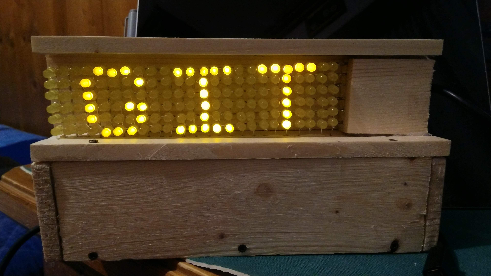
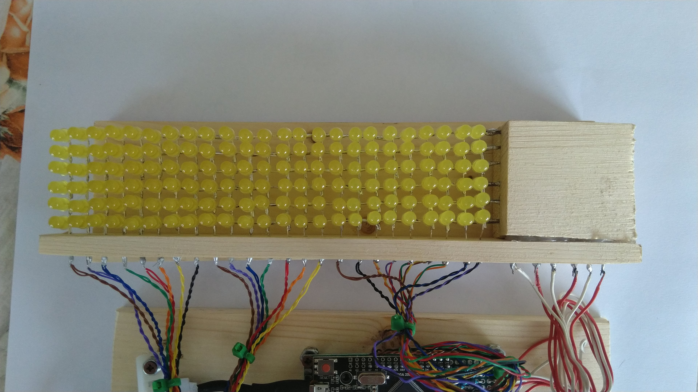
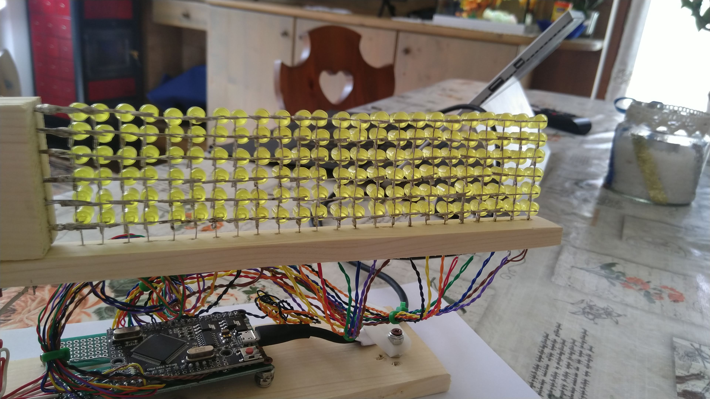

# ArduinoLedMatrix
Arduino code to run an m*n led matrix powered by Arduino.

This is a complete guide to perform both hardware and software. Please enjoy.



<video controls loop width="1920" height="1080">
  <source src="Images/Github_animated.mp4" type="video/mp4">
</video>

-----------------------

## Table of contents
- [0. Introduction](#0)
  - [0.0. Requirements ](#0.0)
  - [0.1. What is it for? ](#0.1)
  - [0.2. What is it NOT for? ](#0.2)
  - [0.3. Features ](#0.3)
- [1. Setup the hardware](#1)	
  - [1.0. Requirements](#1.0)
  - [1.1. Prepare a support for welding](#1.1)
  - [1.2. Solder the matrix](#1.2)
  - [1.3. Connect to Arduino](#1.3)
- [2. Setup the software](#2)	
  - [2.0. Requirements](#2.0)
  - [2.1. Clone](#2.1)
  - [2.2. pins.h](#2.2)
  - [2.3. MatrixLedManager.ino](#2.3)	
  - [2.4. Try the example](#2.4)
- [3. Play with the software](#3)	
  - [3.0. Requirements](#3.0)
  - [3.1. Add letters](#3.1)
  - [3.2. Add words](#3.2)
  - [3.3. Add alphabets](#3.3)
  - [3.4. Add animations](#3.4)
  - [3.5. Understanding basic functions](#3.5)	

----------------

## 0. Introduction <a name="0"></a>	
#### 0.0. Requirements <a name="0.0"></a>	

- Arduino.
- Wires, Resistors, other basic components.
- A lot of LEDs.
- Welder.
- Basic understanding of circuits.
- Basic understanding of C code.
- Basic understanding of Arduino code.
- Time, a lot of time.

#### 0.1. What is it for? <a name="0.1"></a>	
- You need to manage a 500 (less or more) leds matrix powered by arduino.
- You want to print words and letter to the matrix.
- You want some animations.
- You need scalable code (here you go).
- You want to add some personalization.
#### 0.2. What is it NOT for? <a name="0.2"></a>	
- You need to make a 200*200 led matrix or so. In this case I'm sure that the entire project can be structured in other ways.
- You want a cube of leds. This is only for matrixs.

#### 0.3. Features <a name="0.3"></a>	
- Manage a m*n matrix of leds.
- Print letters and words to the matrix.
- Anim letter and words.
- Personalize and add you features.


----------------
## 1. Setup the hardware <a name="1"></a>	
In this section is described one way to prepare the hardware. Of course there are other ways to do it for example you can use transistors, shift registers and much more can be done to overall improve the project. I decided to keep the hardware as simple as possible so it is just made of leds, arduino, wires and resistor, that's it.





#### 1.0. Requirements <a name="1.0"></a>	

- Arduino (mega).
- Wires, Resistors, other basic components.
- A lot of LEDs.
- Welder.
- Basic understanding of circuits.

#### 1.1. Prepare a support for welding <a name="1.1"></a>	
- Take a sufficiently large piece of wood and make some 5mm (if you have 5mm LEDs) holes.
#### 1.2. Solder the matrix <a name="1.2"></a>	
- Start from the bottom left.
- Insert 2 LEDs in the first columns of the wood piece.
- Connect the "-" through the 2 LEDs.
- Add a third LED in the column and connect it.
- When the column is completed, add 2 LEDs in the column next to the right.
- Connect the minus vertically and complete the second column.
- Now you have 2 columns. Connect them horizontally with the positive pins.
- Continue adding columns in this way until you are done.

#### 1.3. Connect to Arduino <a name="1.3"></a>	
- Connect the rows to 320ohm resistors and connect the resistors to Arduino.
- Connect the columns directly to Arduino.
- That's it.
- Now you can go through the next section.


----------------
## 2. Setup the software <a name="2"></a>	
#### 2.0. Requirements <a name="2.0"></a>	
- Basic understanding of C code.
- Basic understanding of Arduino code.

#### 2.1. Clone <a name="2.1"></a>	
- Clone the repo.
- The code is in the folder `ArduinoLedMatrix\Code\MatrixLedManager`
- Open the project with the Arduino ide.
#### 2.2. pins.h <a name="2.2"></a>	
Go to the `pins.h` file and change the values as follows.

- Set +/- values.

  If you have connected the pins like section 1 describes , you have "+" on columns so the code should be:

  ```C
  //if + is on cols
  int ROW_ENABLED   = LOW;
  int ROW_DISABLED  = HIGH;
  int COL_ENABLED   = HIGH;
  int COL_DISABLED  = LOW;
  //------------------------
  
  //uncomment if + is on rows
  //int ROW_ENABLED   = HIGH;
  //int ROW_DISABLED  = LOW;
  //int COL_ENABLED   = LOW;
  //int COL_DISABLED  = HIGH;
  //------------------------
  ```

  If you have "+" on rows, then comment the first block and uncomment the second.

- Declare how many pins you have.

  If you have 6 rows and 24 for columns set the values as follows:

  ```C
  int ROWS = 6;    //the number of phisical rows
  int COLS = 24;   //the number of phisical columns
  int PINS = 30;   //COLS + ROWS
  ```

- Declare how you have connected physical pins to Arduino:

  If you have 6 rows and 24 columns and you have connected (from top to bottom) the first row to pin 37, the second row to pin 39, ... and (from left to right) the first column to pin 2, ... the code may look like this:

  ```C
  /*ARDUINO PINS--------------------------------------*/ 
  int rows[] = {37, 39, 41, 43, 45, 47};//from up to bottom    r0 r1 r2 r3 r4...
  int cols[] = {2,4,6,8,10,12,14,16,18,20,22,24,26,28,30,35,33,34,36,38,40,42,44,46}; //from left to right   c0 c1 c2 c3...
  ```

#### 2.3. MatrixLedManager.ino <a name="2.3"></a>	
- Add an alphabet. You can chose between an alphabet with letters of 6 rows and 5 columns and a smaller alphabet of 5 rows and 4 columns.

  If you want the larger alphabet the code should be:

  ```C
  //#include "alphabet_5_4_.h" //a collection of letters
  #include "alphabet_6_5_.h"   //a collection of letters
  ```

#### 2.4. Try the example <a name="2.4"></a>	

- Connect Arduino to your pc.
- Compile and run.
- Watch the magic.
- If it works then go to the next section; if it doesn't work, make it works.


----------------
## 3. Play with the software <a name="3"></a>	
Now that you have the example running you can go deeper and set you words.

#### 3.0. Requirements<a name="3.0"></a>	

- Basic understanding of C code.
- Basic understanding of Arduino code.

#### 3.1. Add letters <a name="3.1"></a>	
- A letter is an array of integers formatted as follows:

  ```c
  /*
   * int LETTER[] = {#rows, #cols, binary sequences}; 
   *         --> #rows and #cols are the numbers of row and columns used by LETTER.
   *         --> Each binary sequence rapresents the state of a row, so there are #row binary sequences.
   *         --> Binary sequences are contained in LETTER[2...2+#rows].
   *         --> "1" in pos j of LETTER[i+2] meanas that the led in row i and col j is active.
   * example:
   * int A[] = {5, 4, 0b0110, 0b1001, 0b1111, 0b1001, 0b1001};
   *         --> A[0]=5.              There are 5 binarry sequences (1 for each row).
   *         --> A[1]=4.              Each binary sequence have 4 digits (1 for each col).
   *         --> A[3+2]=A[5]=0b1001   Represents the state of leds in row i-2=5-2=3.
   *         --> The first and the last leds of row 3 are turned on.
   */
  ```

- You can define your 6x5 letters in `alphabet_6_5_.h`, you can define your 5x4 letters in `alphabet_5_4_.h`, or you can define your m by n letters in a new file  `alphabet_m_n_.h`.
#### 3.2. Add words <a name="3.2"></a>	
- A valid world is just an array of valid letters.

  ```c
  /*
   * A VALID WORD is just an array of pointers of letters
   * example: int *MYWORD[5] = {H,E,L,L,O};
   */
  ```

- You can define your words in the file `words.h`

#### 3.3. Add alphabets <a name="3.3"></a>	
- An alphabet with symbols of m rows and n columns, is a collection of valid letters.

#### 3.4. Add animations <a name="3.4"></a>	
- ...

#### 3.5. Understanding basic functions <a name="3.5"></a>	
- The basic functions are:

  ```C
  /* SPECIFIC===========================================
   * Manage a m*n matrix of leds to write letters and words.
   * drawWord          (word, letters, startingCol, cycles)
   * animWord          (word, letters, startingCol, endCol, cycles)
   * drawWordInPlace   (word, letters, startingCol, cycles)
   * animWordInPlace   (word, letters, startingCol, endCol, cycles)
   * drawLetter        (letter, startingCol, cycles)
   * animLetter        (letter, startingCol, endCol, cycles)
   */
  ```

  